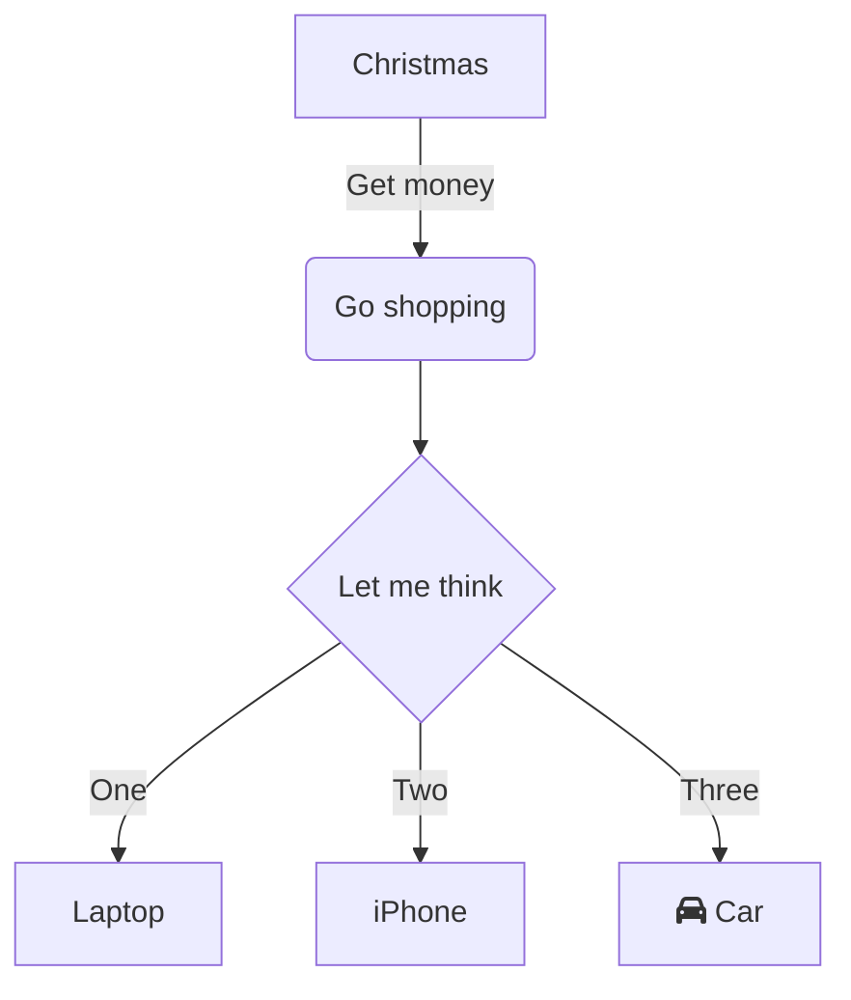

# rspress-plugin-mermaid


import { SourceCode, PackageManagerTabs } from 'rspress/theme';

<SourceCode href="https://github.com/byteHulk/rspress-plugin-mermaid" />

Rspress plugin to render [Mermaid](https://mermaid.js.org/#/) diagrams in markdown files.

Write mermaid as code blocks in markdown files and they will be rendered as SVGs:

````markdown

````

<div align="center">
  
</div>

## Usage

<PackageManagerTabs command="add rspress-plugin-mermaid -D" />

```ts
import * as path from 'path';
import { defineConfig } from 'rspress/config';
import mermaid from 'rspress-plugin-mermaid';

export default defineConfig({
  root: path.join(__dirname, 'docs'),
  plugins: [mermaid()],
});
```

## Configure

### mermaidConfig

Mermaid configuration options, will be passed to `mermaid.initialize` function. See [mermaid documentation](https://mermaid.js.org/config/schema-docs/config.html) for more details.

- Type: `object`

```ts
import * as path from 'path';
import { defineConfig } from 'rspress/config';
import mermaid from 'rspress-plugin-mermaid';

export default defineConfig({
  root: path.join(__dirname, 'docs'),
  plugins: [
    mermaid({
      mermaidConfig: {
        theme: 'forest',
      },
    }),
  ],
});
```
