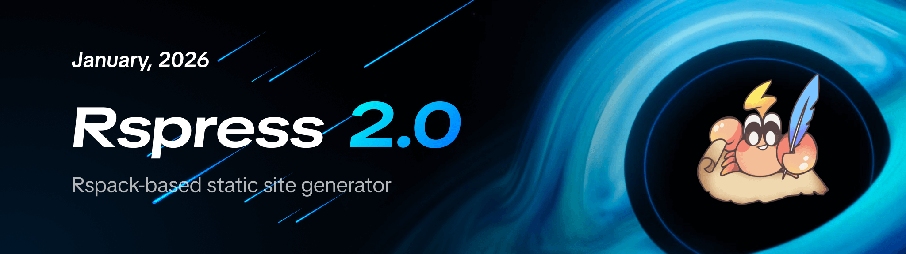
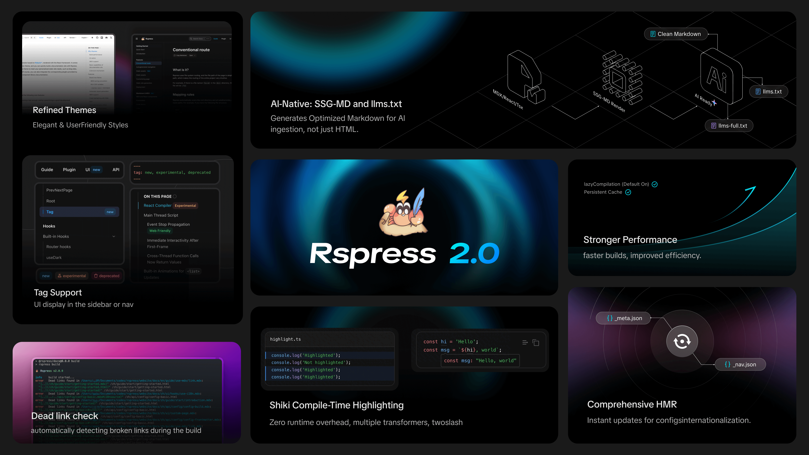
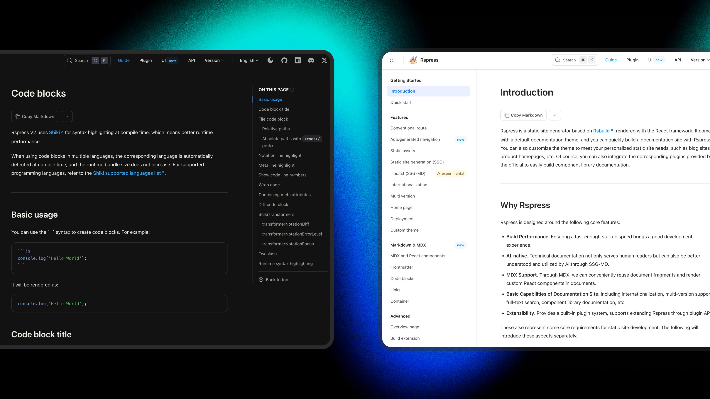
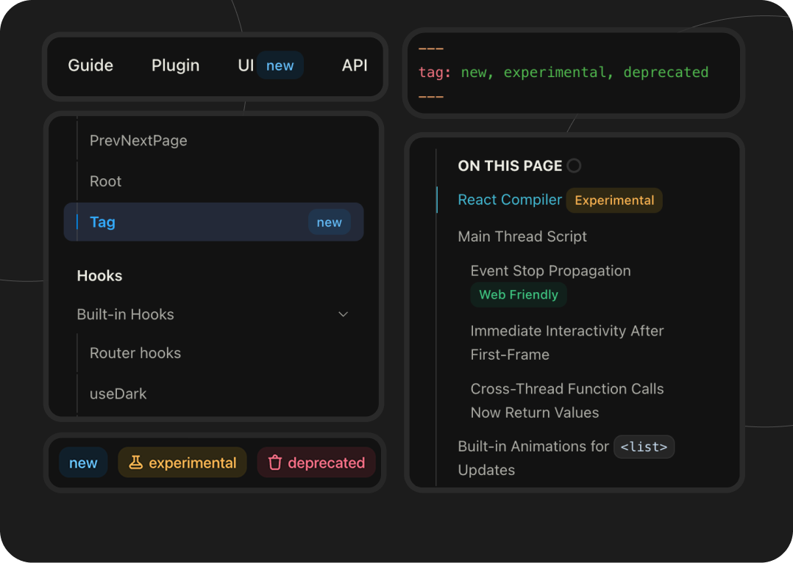
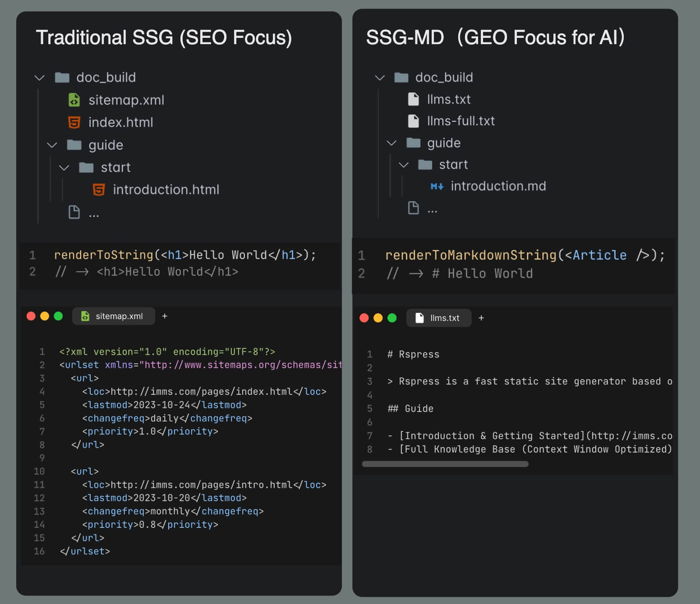
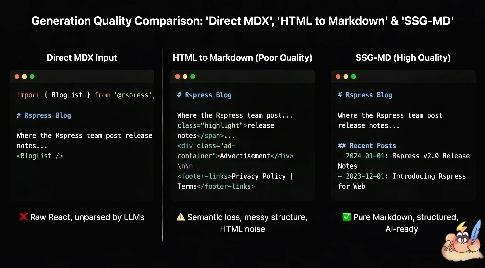
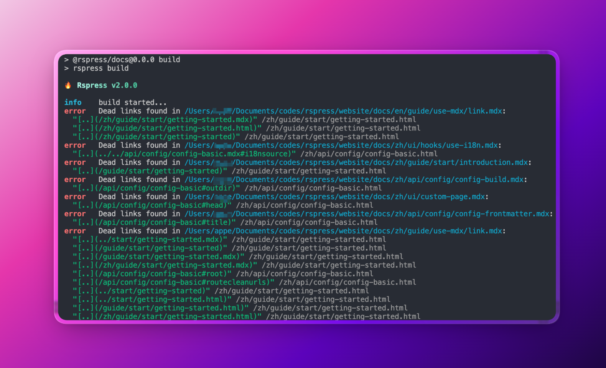

_January 30, 2026_

# Announcing Rspress 2.0



---

We are excited to announce the official release of Rspress 2.0!

Rspress is a static site generator built on [Rsbuild](https://rsbuild.rs/), designed as a documentation site tool for developers. Since its initial release in 2023, Rspress 1.x has gone through **144 releases**, with **125 contributors** participating in the project. More and more developers have chosen Rspress for its **fast compilation performance, convention-based routing, and component library previews** to build beautiful and reliable documentation sites.

Based on community feedback, Rspress 2.0 brings major improvements to [**theme aesthetics**](#brand-new-theme), [**AI-native**](#llms-txt-ssg-md), [**documentation development experience**](#doc-dx), [**integration with Rslib**](#rslib-rspress), and more.

## Why Rspress 2.0

Rspress 1.x already solved the compilation performance problem for documentation site frameworks, but some other issues still affected the core experience as a documentation development tool. Version 2.0 goes beyond the pursuit of compilation performance and also focuses on other aspects of the documentation site experience:

- **Theme Styling**: A **more beautiful default theme**, along with multiple [custom theme](/guide/basic/custom-theme) approaches, addressing the lack of stable APIs for theme customization in 1.x.

- **AI-native**: Documentation serves not only human readers but also needs to be better understood and used by Agents. Rspress now has built-in [llms.txt](https://llmstxt.org/) generation and the [**SSG-MD**](/guide/basic/ssg-md) capability derived from SSG, generating high-quality Markdown content for Agents to read.

- **lazyCompilation, Instant Startup**: [lazyCompilation](https://rspack.rs/guide/features/lazy-compilation) is enabled by default, combined with resource preloading on link hover, building only the required files when visiting specific routes, achieving **instant startup** regardless of project size.

- **Shiki Code Highlighting**: Shiki is integrated by default, completing **syntax highlighting at build time**, with support for theme switching and transformer extensions like [@rspress/plugin-twoslash](/plugin/official-plugins/twoslash), delivering richer code block display effects.

- **Documentation Development Experience**: Optimized HMR for `_nav.json`, `_meta.json` and other files, added [json schema](/guide/basic/auto-nav-sidebar#json-schema-type-hints) for IDE code hints; dead link checking enabled by default; new file code block syntax supporting external file references; [@rspress/plugin-preview](/plugin/official-plugins/preview) and [@rspress/plugin-playground](https://rspress.rs/plugin/official-plugins/playground) can now be used simultaneously.

- **Rslib Integration**: You can now select Rspress as the documentation tool when creating a component library project with `create-rslib`, quickly setting up a component documentation site.

This is a comprehensive upgrade to the existing architecture. Below we introduce Rspress 2.0 and its **brand new theme, high-quality llms.txt generation, Shiki integration, lazyCompilation**, and other important features.



## 2.0 New features

### Brand new theme \{#brand-new-theme}

The 2.0 default theme has undergone a systematic upgrade, crafted by designer [@Zovn Wei](https://x.com/wei_zhong41532), with significant improvements in visual effects and reading experience. Each component is individually replaceable, providing high customizability.



#### Theme customization

From low to high levels of customization, there are four [custom theme](/guide/basic/custom-theme) approaches: CSS variables, BEM class names, ESM re-export overrides, and component eject.

- **CSS Variables**: The new theme exposes more CSS variables, covering theme colors, code blocks, homepage styles, and more. You can interactively preview and adjust all CSS variables on the [CSS Variables](/ui/vars) page, then copy the configuration directly into your project once you find a satisfying setup.

```css
:root {
  /* Custom theme colors */
  --rp-c-brand: #3451b2;
  --rp-c-brand-dark: #2e4599;
  /* Custom code block styles */
  --rp-code-block-bg: #1e1e1e;
}
```

- **BEM Class Names**: All built-in components now adopt the [BEM naming convention](https://getbem.com/). This is an old-school choice, but also a well-considered decision. Users can precisely adjust styles through CSS selectors, with clearer HTML structure; at the same time, it decouples from any CSS framework the user may be using, allowing free choice of CSS frameworks ([Tailwind](https://tailwindcss.com/), [Less](https://lesscss.org/), [Sass](https://sass-lang.com/), etc.), such as using Tailwind V4 or V3 without worrying about version conflicts with Rspress's built-in CSS.

```css
/* BEM naming convention */
.rp-[component-name]__[element-name]--[modifier-name] {
}

/* Easily override component styles using BEM class names */
.rp-nav__title {
  height: 32px;
}
.rp-nav-menu__item--active {
  color: purple;
}
```

- **ESM Re-export Overrides**: If CSS modifications cannot meet your customization needs, you can perform deeper customization through JS. Using [ESM re-exports](/guide/basic/custom-theme#reexport) in `theme/index.tsx`, you can **override** any built-in Rspress component.

```tsx title="theme/index.tsx"
import { Layout as BasicLayout } from '@rspress/core/theme-original';

const Layout = () => <BasicLayout beforeNavTitle={<div>some content</div>} />;

export { Layout }; //[!code highlight]
export * from '@rspress/core/theme-original'; //[!code highlight]
```

- **Component Eject**: You can use the new [`rspress eject [component]`](/api/commands#rspress-eject) command, which copies the source code of the specified component to the `theme/components/` directory. You can freely modify this code, or even hand it to AI for modifications, to achieve deep customization.

```bash
# Export the DocFooter component to the theme directory
rspress eject DocFooter
```

#### Navbar and sidebar tags

Rspress 2.0 implements a [Tag component](/ui/layout-components/tag). You can now use the tag property in frontmatter to add UI annotations in the sidebar or navbar.

```mdx
---
tag: new, experimental # Displayed in H1 and Sidebar
---

import { Tag } from '@rspress/core/theme';

# Tag

## Common tags <Tag tag="new" /> {/* displayed in the right-side outline */}
```

<div style={{ display: 'flex', justifyContent: 'center' }}>
  
</div>

#### Built-in Multi-language Support

In version 1.x, Rspress only had English text built-in. Using other languages like zh required configuring all text manually, which was cumbersome. Now the 2.0 theme includes built-in translations for zh, en, ja, ko, ru, and more languages. The system automatically performs "Tree Shaking" based on language configuration and usage, bundling only the text and languages you use. Languages not built-in will fall back to en text. You can also extend or override translations through the [`i18nSource`](/api/config/config-basic#i18nsource) configuration option.

Rspress will support more built-in languages in the future. If you're interested, please refer to [this contributor's Pull Request](https://github.com/web-infra-dev/rspress/pull/2827).

### llms.txt: SSG-MD for High-Quality Markdown content \{#llms-txt-ssg-md}

Rspress now integrates [llms.txt](https://llmstxt.org/) generation into core, and implements the new SSG-MD (Static Site Generation to Markdown) capability.

In React-based dynamic rendering frontend frameworks, extracting static information is often difficult, and Rspress faces the same challenge. Rspress allows users to enhance documentation expressiveness through [MDX fragments](/guide/use-mdx/components), React components, Hooks, and TSX routes. However, this dynamic content faces the following issues when converting to Markdown text:

- Feeding MDX directly to AI includes a large amount of code syntax noise and loses React component content
- Converting HTML to Markdown often yields poor results with unreliable information quality

To solve this problem, Rspress 2.0 introduces the [SSG-MD](/guide/basic/ssg-md) feature. This is a new capability, similar to [Static Site Generation (SSG)](/guide/basic/ssg), but instead of rendering pages as HTML files, it renders them as Markdown files and generates [llms.txt](https://llmstxt.org/) and llms-full.txt files.

<div style={{ display: 'flex', justifyContent: 'center' }}>
  
</div>

Compared to traditional approaches like converting HTML to Markdown, SSG-MD has access to richer information sources during rendering, such as the React virtual DOM, resulting in higher static information quality and flexibility.

<div style={{ display: 'flex', justifyContent: 'center' }}>
  
</div>

Enabling it is simple:

```typescript
import { defineConfig } from '@rspress/core';

export default defineConfig({
  llms: true,
});
```

After building, the following structure will be generated:

```tree
doc_build
├── llms.txt
├── llms-full.txt
├── guide
│   └── start
│       └── introduction.md
└── ...
```

If you want to customize the rendering content in custom components, you can control it through environment variables:

```tsx
export function Tab({ label }: { label: string }) {
  if (import.meta.env.SSG_MD) {
    // Output plain text description in SSG-MD mode
    return <>{`**Tab: ${label}**`}</>;
  }
  // Render interactive component normally
  return <div className="tab">{label}</div>;
}
```

This preserves the interactive documentation experience while helping AI understand the semantic information of components.

> See [SSG-MD Usage Guide](/guide/basic/ssg-md) for details

### Shiki Build-time code block highlighting \{#shiki-code-highlighting}

Rspress 2.0 uses [Shiki](https://shiki.style/) by default for code highlighting. Compared to the 1.x Prism runtime highlighting approach, Shiki performs highlighting at compile time.

1. Supports multiple theme styles. You can interactively switch and preview different Shiki themes on the [CSS Variables](/ui/vars) page.
1. Shiki also allows extensions through custom [transformers](https://shiki.style/guide/transformers) to enrich writing, such as twoslash.
1. Programming languages are imported on demand, adding no runtime overhead or bundle size.
1. Achieves accurate syntax highlighting consistent with VS Code based on TextMate grammar.

Here are some Shiki transformer examples to give you a feel for the documentation creativity Shiki enables:

> Using [@rspress/plugin-twoslash](/plugin/official-plugins/twoslash)

```ts twoslash
const hi = 'Hello';
const msg = `${hi}, world`;
//    ^?
```

> Using [transformerNotationFocus](/guide/use-mdx/code-blocks#transformernotationfocus)

```ts
console.log('Not focused');
console.log('Focused'); // [!code focus]
console.log('Not focused');
```

> See [Code Blocks](/guide/use-mdx/code-blocks#shiki-transformers) for details

### Build Performance: lazyCompilation and persistent cache \{#build-performance-lazy-compilation-cache}

Rspress 2.0 is powered by Rsbuild and Rspack 2.0 prerelease, with [lazyCompilation](https://rspack.rs/guide/features/lazy-compilation) and [persistent cache](https://rsbuild.rs/config/performance/build-cache) enabled by default.

#### lazyCompilation

[dev.lazyCompilation](https://rsbuild.rs/config/dev/lazy-compilation) is enabled by default — pages are only compiled when you visit them, dramatically improving development startup speed and even achieving millisecond-level cold starts. Rspress also implements a route preload strategy that preloads target route pages when hovering over links, working together with lazyCompilation to provide a lossless development experience.

<div style={{ display: 'flex', justifyContent: 'center' }}>
  
</div>

#### Persistent cache

2.0 also enables [persistent cache](https://rsbuild.rs/config/performance/build-cache) by default, reusing previous compilation results during warm starts to improve build speed by 30%-60%. This means that once you've run `rspress dev` or `rspress build` in your project, subsequent `rspress` startups will be noticeably faster.

### Documentation development experience \{#doc-dx}

#### Dead link checking enabled by default

Rspress 2.0 enables dead link checking by default. During the build process, it automatically detects invalid links in documentation, helping you discover and fix issues promptly.

```typescript
import { defineConfig } from '@rspress/core';

export default defineConfig({
  markdown: {
    link: {
      checkDeadLinks: true, // Enabled by default, can be disabled with false
    },
  },
});
```

<div style={{ display: 'flex', justifyContent: 'center' }}>
  
</div>

> See [Links](/guide/use-mdx/link) for details

#### File code blocks

You can use the `file="./path/to/file"` attribute to reference external files as code block content, maintaining example code in separate files.

````mdx
```ts file="./_demo.ts"

```
````

````mdx
```tsx file="<root>/src/components/Button.tsx"

```
````

> See [File Code Blocks](/guide/use-mdx/code-blocks#file-code-block) for details

#### More flexible meta usage for preview

[@rspress/plugin-preview](/plugin/official-plugins/preview) is now based on meta attributes, making it more flexible and compatible with file code blocks.

Here is an example using iframe preview for a code block:

````mdx
```tsx preview="iframe-follow" file="./_demo.ts"

```
````

It will render as:

```tsx preview="iframe-follow"
import { useState } from 'react';

function App() {
  const [count, setCount] = useState(0);

  return (
    <div style={{ textAlign: 'center' }}>
      <p>Current count: {count}</p>
      <button onClick={() => setCount(count + 1)}>+</button>
      <button onClick={() => setCount(count - 1)}>-</button>
    </div>
  );
}

export default App;
```

Additionally, [@rspress/plugin-playground](/plugin/official-plugins/playground) now supports being used together with plugin-preview, switching via meta attributes, e.g., ` ```tsx playground `

#### HMR support for configuration files

Based on the redesigned [virtual module plugin](https://github.com/rstackjs/rsbuild-plugin-virtual-module) for Rsbuild, HMR is now supported for `i18n.json`, `_nav.json`, `_meta.json`, file code blocks, and iframe-related configurations in `@rspress/plugin-preview`. After modifying these configuration files, the page will automatically hot-reload without manual refresh.

### Rslib & Rspress \{#rslib-rspress}

When creating a project with `create-rslib`, you can now select the Rspress tool. This allows you to quickly set up a documentation site alongside your component library for writing usage guides, displaying API references, or live-previewing component effects.

Run `npm create rslib@latest` and select Rspress to generate the following file structure:

```tree
├── docs
│   └── index.mdx
├── src
│   └── Button.tsx
├── package.json
├── tsconfig.json
├── rslib.config.ts
└── rspress.config.ts
```

The template includes the [rsbuild-plugin-workspace-dev](https://github.com/rstackjs/rsbuild-plugin-workspace-dev) plugin, which automatically runs Rslib's watch command alongside the Rspress development server.

Simply run `npm run doc` to start the Rspress development server and preview your Rslib component library:

```json title="package.json"
{
  "scripts": {
    "dev": "rslib build --watch",
    "doc": "rspress dev" // Run this command
  }
}
```

### More official Rspress plugins

Rspress 2.0 has added several official plugins:

- [**@rspress/plugin-algolia**](/plugin/official-plugins/algolia): Replace Rspress's built-in search with [Algolia DocSearch](https://docsearch.algolia.com/) (thanks to the [@algolia](https://x.com/algolia) team for their assistance).
- [**@rspress/plugin-twoslash**](/plugin/official-plugins/twoslash): Add type hints to TypeScript code blocks.
- [**@rspress/plugin-llms**](/plugin/official-plugins/llms): Provide llms.txt generation capability for projects that don't support SSG and SSG-MD.
- [**@rspress/plugin-sitemap**](/plugin/official-plugins/sitemap): Automatically generate [Sitemap](https://www.sitemaps.org) files for SEO optimization.

---

## Other breaking changes

### Migrating from Rspress 1.x

If you are a 1.x user, we have prepared a detailed migration guide to help you upgrade from 1.x to 2.0.

You can use the "Copy Markdown" feature on the page and feed it to your preferred coding agent (such as Claude Code) to complete the migration.

> Please refer to the [Migration Guide](/guide/migration/rspress-1-x).

### Removal of `mdxRs` configuration

We noticed that a large portion of 1.x users were actively disabling `mdxRs` to use Shiki, component library preview features, and custom remark/rehype plugins. With lazyCompilation and persistent cache enabled, performance optimization is already quite significant even with the JS version of the MDX parser.

In exchange for better extensibility and maintainability, we decided to stop using the Rust-based MDX parser (`@rspress/mdx-rs`) in the Markdown/MDX compilation pipeline. This enables Rspress to better integrate tools from the JavaScript ecosystem like Shiki.

### Node.js and upstream dependency version requirements

Rspress 2.0 requires Node.js version **20+** and React version **18+**.

| Dependency         | Allowed Range          | Default | Notes                                                           |
| ------------------ | ---------------------- | ------- | --------------------------------------------------------------- |
| `react`            | `^18.0.0 \|\| ^19.0.0` | 19      | React 17 no longer supported; uses project version if installed |
| `react-dom`        | `^18.0.0 \|\| ^19.0.0` | 19      | Matches react version                                           |
| `react-router-dom` | `^6.0.0 \|\| ^7.0.0`   | 7       | Uses project version if installed                               |
| `unified`          | `^11.0.0`              | 11      | Custom remark/rehype plugins must be compatible                 |

### Package name and import path changes

Rspress has consolidated `rspress`, `@rspress/runtime`, `@rspress/shared`, and `@rspress/theme-default` into `@rspress/core`. Projects and plugins now only need to install a single `@rspress/core` package.

```diff title="package.json"
{
  "dependencies": {
-   "rspress": "1.x"
-   "@rspress/shared": "1.x"
+   "@rspress/core": "^2.0.0"
  }
}
```

```diff title="rspress.config.ts"
- import { defineConfig } from 'rspress/config';
+ import { defineConfig } from '@rspress/core';
```

```diff title="docs/index.mdx"
- import { useDark } from 'rspress/runtime'
- import { PackageManagerTabs } from 'rspress/theme';
+ import { useDark } from '@rspress/core/runtime'
+ import { PackageManagerTabs } from '@rspress/core/theme';
```

If you have developed an Rspress plugin, please change the plugin's peerDependencies from `rspress` to `@rspress/core`:

```json
{
  "peerDependencies": {
    "@rspress/core": "^2.0.0"
  }
}
```

## Next steps

The release of Rspress 2.0 is just a new beginning. After this release, Rspress will continue to iterate:

- **Advancing Ecosystem Integration**: Deeper integration with Rslib and Rstest to provide an integrated development experience for frontend projects and component library projects.

- **Exploring Deeper AI and Documentation Integration**: Such as intelligent Q&A, automatic summarization, and more; refining SSG-MD to make it stable and easier to use.

Thank you to all developers and users who have contributed to Rspress! If you encounter any issues or have suggestions during use, please provide feedback in [GitHub Issues](https://github.com/web-infra-dev/rspress/issues).

Upgrade to Rspress 2.0 now and experience a brand new documentation development journey!

import { PackageManagerTabs } from '@rspress/core/theme';

<PackageManagerTabs command="create rspress@latest" />
