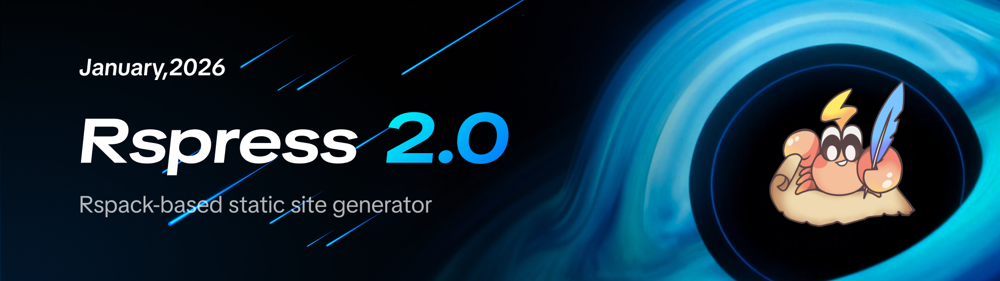
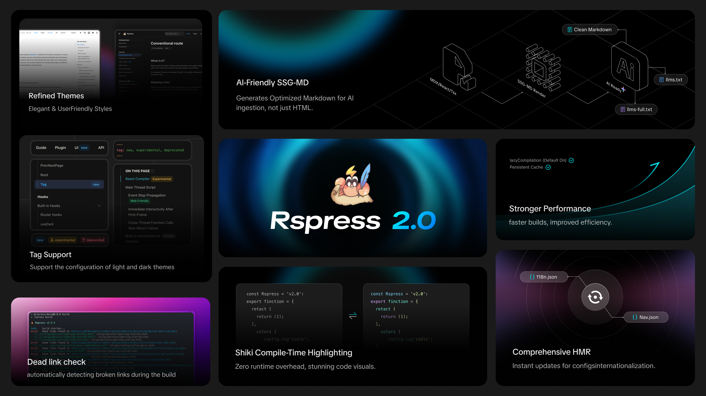
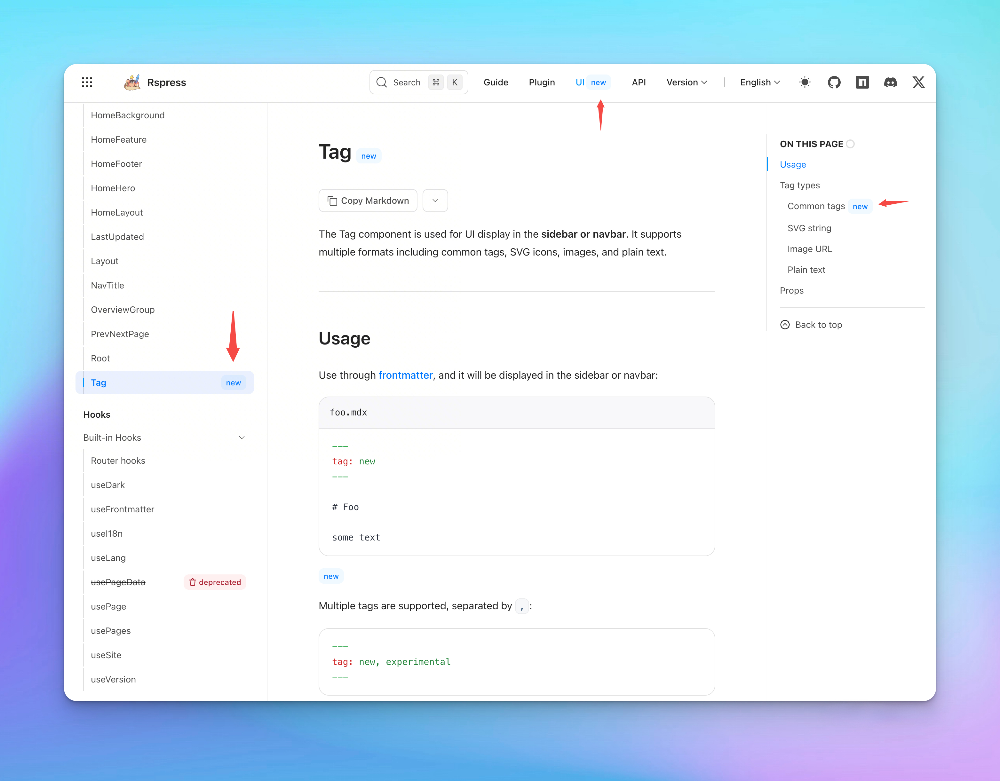
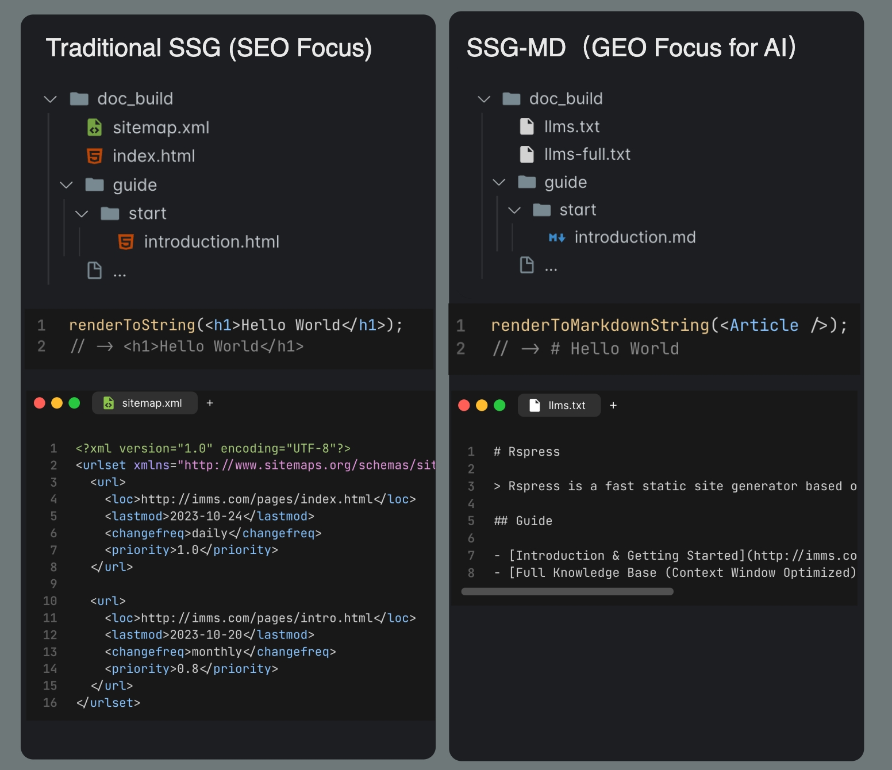
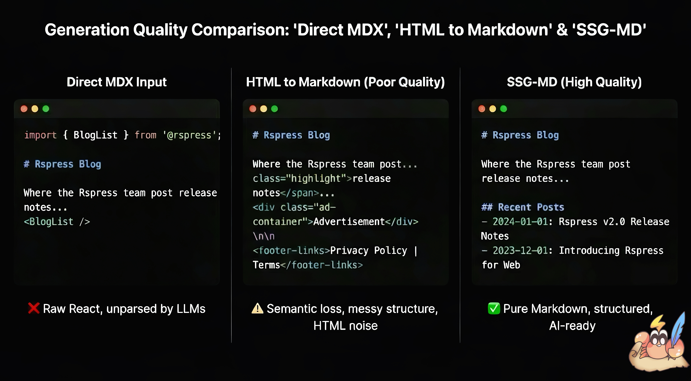
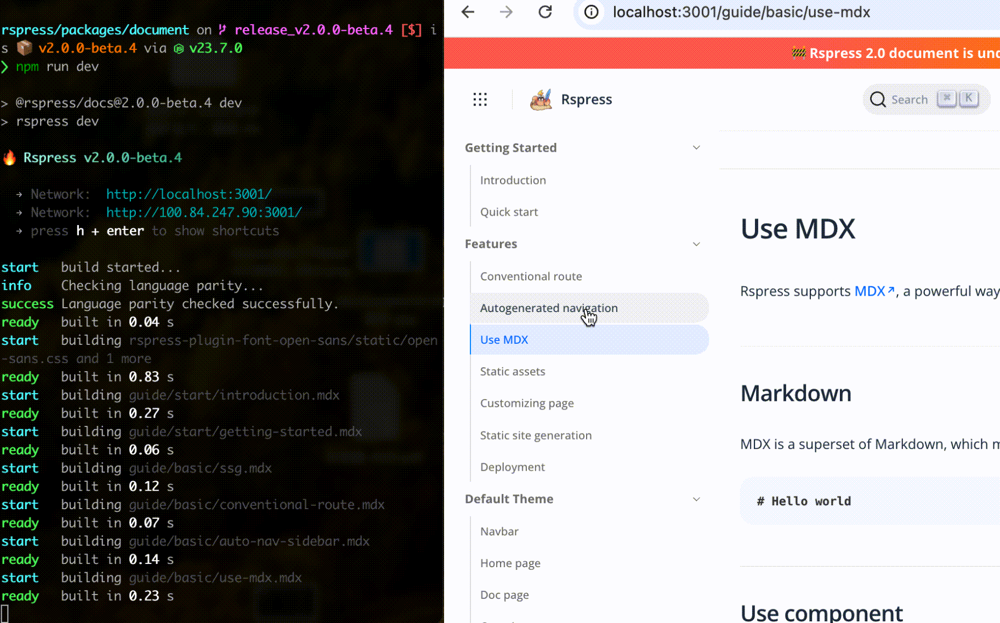

_2026 年 1 月 29 日_

# Rspress 2.0 发布公告



---

我们很高兴地宣布 Rspress 2.0 的正式发布！

Rspress 是基于 [Rsbuild](https://rsbuild.rs/) 的静态站点生成器，是一个面向开发者的文档站开发工具。自 Rspress 2023 年正式发布已经过了三年时间。截至 1.47.0 版本，Rspress 共迭代了 **144 个版本**，也收到了社区大量的反馈和贡献，共有 **125 位贡献者** 参与了 Rspress 项目。在社区的贡献和支持下，越来越多的开发者使用 Rspress **极致的编译性能、约定式路由、组件库预览**等功能搭建美观可靠的文档站点。

在此基础上，根据用户的反馈和建议，我们希望在 [**主题美观度**](#brand-new-theme)、 [**AI-native**](#llms-txt-ssg-md)、[**文档开发体验**](#doc-dx) 等各方面更进一步。

## 为什么是 Rspress 2.0

Rspress 1.x 已经解决了文档站框架编译性能的问题，但仍存在一些其他问题影响着作为一个文档开发工具的核心体验。2.0 版本将不止于对编译性能的追求，也聚焦于文档站体验的其他方面：

- **主题样式**：一套**更美观的默认主题**，并提供了多种 [自定义主题](/zh/guide/basic/custom-theme) 方式，解决了 1.x 在主题定制上缺乏稳定 API 的问题。

- **AI-native**：文档不仅服务于人类读者，也需要被 Agent 更好地理解和使用。Rspress 现在内置了 [llms.txt](https://llmstxt.org/) 生成和从 SSG 衍生出的 [**SSG-MD**](/zh/guide/basic/ssg-md) 功能，生成高质量的 Markdown 渲染内容被 Agent 读取。

- **按需编译，瞬间启动**：默认启用 [lazyCompilation](https://rspack.rs/guide/features/lazy-compilation)，配合链接 hover 时对资源的 preload 功能，仅在访问特定路由时构建所需文件，实现无论项目规模多大，dev 也可**瞬间启动**。

- **Shiki 代码高亮**：默认集成 Shiki，在**构建时完成语法高亮**，支持主题切换、transformer 扩展，比如 [@rspress/plugin-twoslash](/plugin/official-plugins/twoslash)，带来更丰富的代码块展示效果。

- **文档开发体验**：优化 `_nav.json`、`_meta.json` 等文件的 HMR 并新增 [json schema](/zh/guide/basic/auto-nav-sidebar#json-schema-类型提示) 用于 IDE 内的代码提示；默认开启死链检查功能；新增文件代码块语法，支持引用外部文件；[@rspress/plugin-preview](/plugin/official-plugins/preview) 和 [@rspress/plugin-playground](https://rspress.rs/plugin/official-plugins/playground) 支持同时使用等。

- **Rslib 集成**：现在可以在使用 `create-rslib` 创建组件库项目时，选择 Rspress 作为文档工具，快速搭建组件文档站点。

这是一次对现有架构的全面升级，下面我将介绍 Rspress 2.0 和它的 **全新主题、高质量 llms.txt 生成、集成 Shiki、按需编译**等重要功能。



## 2.0 新特性

### 全新主题 \{#brand-new-theme}

2.0 默认主题迎来了一次系统性升级，它由团队设计师 [@Zovn Wei](https://x.com/wei_zhong41532) 整体设计，在视觉效果和阅读体验上都有较大幅度提升，并且每个组件单一可替换，拥有很高的可定制性。


#### 主题定制

按照定制化程度从低到高，有 CSS 变量、BEM 类名、ESM 重导出覆盖、组件 eject 四种[自定义主题](/zh/guide/basic/custom-theme)方式。

- **CSS 变量**：新主题暴露了更多 CSS 变量，覆盖主题色、代码块、首页等样式。你可以在 [CSS 变量](/zh/ui/vars) 页面交互式地预览和调整所有 CSS 变量，找到满意的配置后直接复制到项目中使用。

```css
:root {
  /* 自定义主题色 */
  --rp-c-brand: #3451b2;
  --rp-c-brand-dark: #2e4599;
  /* 自定义代码块样式 */
  --rp-code-block-bg: #1e1e1e;
}
```

- **BEM 类名**：内置组件现在均采用 [BEM 命名规范](https://getbem.com/)。这是一个十分 Old School 的选择，但也是我们深思熟虑的决定。用户可以通过 CSS 选择器精准调整样式，HTML 结构更加清晰；同时与 Rspress 用户自身使用的 CSS 框架解耦，用户可以任意选择 CSS 框架（[Tailwind](https://tailwindcss.com/)、[Less](https://lesscss.org/)、[Sass](https://sass-lang.com/) 等），比如使用 Tailwind V4 或 V3 而不用担心版本，也不用担心与 Rspress 内置 CSS 产生冲突。

```css
/* BEM 命名规范 */
.rp-[component-name]__[element-name]--[modifier-name] {
}

/* 根据 BEM 类名轻松覆盖组件样式 */
.rp-nav__title {
  height: 32px;
}
.rp-nav-menu__item--active {
  color: purple;
}
```

- **ESM 重导出覆盖**：如果 CSS 上的修改无法满足定制需求，可以通过 JS 进行更深度的定制。在 `theme/index.tsx` 中利用 [ESM 重导出](/zh/guide/basic/custom-theme#reexport)，可以**覆盖**任意一个 Rspress 的内置组件。

```tsx title="theme/index.tsx"
import { Layout as BasicLayout } from '@rspress/core/theme-original';

const Layout = () => <BasicLayout beforeNavTitle={<div>some content</div>} />;

export { Layout }; //[!code highlight]
export * from '@rspress/core/theme-original'; //[!code highlight]
```

- **组件 eject**：你可以使用全新的 [`rspress eject [component]`](/zh/api/commands#rspress-eject) 命令，这个命令会将指定组件的源代码复制到 `theme/components/` 目录下，你可以自由修改这些代码，甚至直接交给 AI 修改，来实现深度定制。

```bash
# 将 DocFooter 组件导出到 theme 目录
rspress eject DocFooter
```

#### 导航栏、侧边栏 tag

Rspress 2.0 实现了 [Tag 组件](/ui/layout-components/tag)，现在可以使用 frontmatter 中的 tag 属性，在侧边栏或导航栏进行 UI 标注。

```mdx
---
tag: new, experimental # 会在 H1 和 Sidebar 进行显示
---

import { Tag } from '@rspress/core/theme';

# Tag

## Common tags <Tag tag="new" /> {/* 会在右侧 outline 进行显示 */}
```

<div style={{ display: 'flex', justifyContent: 'center' }}>
  
</div>

#### 内置多语言支持

在 1.x 版本中，Rspress 仅内置了英文文本，如果使用其他语言例如 zh，必须对所有的文本都进行配置，使用起来较为繁琐。现在 2.0 主题内置了 zh、en、ja、ko、ru 等多种语言的翻译文本，系统会自动根据语言配置和使用进行 "Tree Shaking"，仅打包你使用到的文本及语言，未内置的语言会兜底到 en 文本。你也可以通过 [`i18nSource`](/zh/api/config/config-basic#i18nsource) 配置项扩展或覆盖翻译文本。

Rspress 未来会支持更多内置语言，如果你有兴趣，请参考 [这位贡献者的 Pull Request](https://github.com/web-infra-dev/rspress/pull/2827)。

### llms.txt：SSG-MD 渲染高质量的 Markdown 内容 \{#llms-txt-ssg-md}

Rspress 现在将 [llms.txt](https://llmstxt.org/) 生成能力集成到 core 中，并实现了全新的 SSG-MD（Static Site Generation to Markdown，静态站点 Markdown 生成）能力。

在基于 React 动态渲染的前端框架中，往往存在静态信息难以提取的问题，Rspress 也遇到了相同的问题。Rspress 允许用户通过 [MDX 片段](/zh/guide/use-mdx/components)、React 组件、Hooks 以及 TSX 路由等动态特性来增强文档表现力。但这些动态内容在转换为 Markdown 文本时会面临以下问题：

- 直接将 MDX 输入给 AI 会包含大量代码语法噪音，并丢失 React 组件内容
- 将 HTML 转为 Markdown 往往效果不佳，信息质量难以保证

为了解决这个问题，Rspress 2.0 引入了 [SSG-MD](/zh/guide/basic/ssg-md) 特性。这是一个全新的功能，它类似于 [静态站点生成（SSG）](/zh/guide/basic/ssg)，但不同之处在于它将你的页面渲染为 Markdown 文件，而非 HTML 文件，并生成 [llms.txt](https://llmstxt.org/) 及 llms-full.txt 相关文件。

<div style={{ display: 'flex', justifyContent: 'center' }}>
  
</div>

相比于将 HTML 转化为 Markdown 等传统方式，SSG-MD 在渲染期间拥有更好的信息源，比如 React 虚拟 DOM，因此拥有更好的静态信息质量和灵活性。

<div style={{ display: 'flex', justifyContent: 'center' }}>
  
</div>

启用方式非常简单：

```typescript
import { defineConfig } from '@rspress/core';

export default defineConfig({
  llms: true,
});
```

构建后将生成如下结构：

```tree
doc_build
├── llms.txt
├── llms-full.txt
├── guide
│   └── start
│       └── introduction.md
└── ...
```

若想对自定义组件中的渲染内容进行定制增强，你也可以通过环境变量来进行控制：

```javascript
export function Tab({ label }: { label: string }) {
  if (import.meta.env.SSG_MD) {
    // SSG-MD 模式下输出纯文本描述
    return <>{"**Tab: ${label}**"}</>;
  }
  // 正常渲染交互式组件
  return <div className="tab">{label}</div>;
}
```

这样既保证了文档的交互体验，也能帮助 AI 理解组件的语义信息。

> 详见 [SSG-MD 使用指南](/zh/guide/basic/ssg-md)

### Shiki 编译时代码块高亮 \{#shiki-code-highlighting}

Rspress 2.0 默认使用 [Shiki](https://shiki.style/) 进行代码高亮。相比 1.x 的 prism 运行时高亮方案，Shiki 在编译时完成高亮处理。

1. 支持多种主题样式，比如在 [CSS 变量](/zh/ui/vars) 页面可以交互式地切换和预览不同的 Shiki 主题。
1. 同时 Shiki 也允许使用自定义的 [transformer](https://shiki.style/guide/transformers) 进行扩展来丰富写作，例如 twoslash 等。
1. 按需引入编程语言，不增加运行时开销和包体积。
1. 基于 TextMate 语法实现与 VS Code 一致的准确语法高亮。

下面是一些 Shiki transformer 的示例，直观感受一下 Shiki 带来的文档创造力：

> 使用 [@rspress/plugin-twoslash](/zh/plugin/official-plugins/twoslash)

```ts twoslash
const hi = 'Hello';
const msg = `${hi}, world`;
//    ^?
```

> 使用 [transformerNotationFocus](/guide/use-mdx/code-blocks#transformer-notation-focus)

```ts
console.log('Not focused');
console.log('Focused'); // [!code focus]
console.log('Not focused');
```

### 构建性能：lazyCompilation 和持久化缓存 \{#build-performance-lazy-compilation-cache}

Rspress 2.0 底层由 Rsbuild 和 Rspack 2.0-alpha 驱动，同时默认开启了 [lazyCompilation](https://rspack.rs/zh/config/experiments#experimentslazycompilation) 和 [持久化缓存](https://rsbuild.rs/zh/config/performance/build-cache)。

#### lazyCompilation 按需编译

lazyCompilation 会在 dev 模式下按需编译，即只有当你访问某个页面时，该页面才会被编译，大幅提升了开发启动速度，甚至实现毫秒级的冷启动。Rspress 同时实现了路由的 preload 策略，当鼠标悬停在链接上时会预先加载目标路由页面，搭配 lazyCompilation 实现无损的开发体验。

<div style={{ display: 'flex', justifyContent: 'center' }}>
  
</div>

#### 持久化缓存

2.0 同时默认开启了 [持久化缓存](https://rsbuild.rs/zh/config/performance/build-cache)，在热启动中复用上次编译的结果，提升 30%-60% 的构建速度。这意味着当你的项目中已经启动过一次 `rspress dev` 或者 `rspress build`，`rspress` 的启动速度都会有明显提升。

### 文档开发体验 \{#doc-dx}

#### 默认开启死链检查

Rspress 2.0 默认开启死链检查功能。在构建过程中，会自动检测文档中的无效链接，帮助你及时发现和修复。

```typescript
import { defineConfig } from '@rspress/core';

export default defineConfig({
  markdown: {
    link: {
      checkDeadLinks: true, // 默认开启，可通过 false 关闭
    },
  },
});
```

<div style={{ display: 'flex', justifyContent: 'center' }}>
  
</div>

#### 文件代码块

你可以使用 `file="./path/to/file"` 属性来引用外部文件作为代码块的内容，将示例代码放在单独的文件中维护。

````mdx
```ts file="./_demo.ts"

```
````

````mdx
```tsx file="<root>/src/components/Button.tsx"

```
````

> 详见 [文件代码块](/zh/guide/use-mdx/code-blocks#file-code-block)

#### preview 更灵活的 meta 用法

[@rspress/plugin-preview](/plugin/official-plugins/preview) 现在基于 meta 属性使用，更加灵活，也可以配合文件代码块。

下面是一个使用 iframe 预览代码块的示例：

````mdx
```tsx preview="iframe-follow" file="./_demo.ts"

```
````

它将会渲染为：

```tsx preview="iframe-follow"
import { useState } from 'react';

function App() {
  const [count, setCount] = useState(0);

  return (
    <div style={{ textAlign: 'center' }}>
      <p>当前计数: {count}</p>
      <button onClick={() => setCount(count + 1)}>+</button>
      <button onClick={() => setCount(count - 1)}>-</button>
    </div>
  );
}

export default App;
```

并且 [@rspress/plugin-playground](/plugin/official-plugins/playground) 现在支持和 plugin-preview 一起使用，通过 meta 属性切换即可，例如 ` ```tsx playground `

#### 支持若干配置文件的 HMR

基于 Rsbuild 重新设计的 [虚拟模块插件](https://github.com/rstackjs/rsbuild-plugin-virtual-module)，现在支持 `i18n.json`、`_nav.json`、`_meta.json`、文件代码块以及 `@rspress/plugin-preview` 中 iframe 相关的 HMR。修改这些配置文件后，页面会自动热更新，无需手动刷新。

### Rslib & Rspress \{#rslib-rspress}

在使用 `create-rslib` 创建项目时，你现在可以选择 Rspress 工具。这让你能够在开发组件库的同时，快速搭建配套的文档站点，用于编写组件的使用说明、展示 API 参考，或实时预览组件效果。

执行 `npm create rslib@latest` 并选中 Rspress，会生成下方的文件结构：

```plaintext
├── docs
│   └── index.mdx
├── package.json
├── tsconfig.json
├── src
│   └── Button.tsx
├── rslib.config.ts
└── rspress.config.ts
```

使用 `npm run doc` 启动 Rspress 的开发服务器对 Rslib 组件库进行预览：

```json
// package.json
"scripts": {
  "dev": "rslib build --watch",
  "doc": "rspress dev",  // 执行该命令
},
```

### 更多 Rspress 官方插件

Rspress 2.0 新增了多个官方插件：

- [**@rspress/plugin-algolia**](/zh/plugin/official-plugins/algolia)：支持替换 Rspress 的内置搜索为 [Algolia DocSearch](https://docsearch.algolia.com/)（感谢 [@algolia](https://x.com/algolia) 团队的协助）。
- [**@rspress/plugin-twoslash**](/zh/plugin/official-plugins/twoslash)：为 TypeScript 代码块添加类型提示。
- [**@rspress/plugin-llms**](/zh/plugin/official-plugins/llms)：为不支持 SSG 和 SSG-MD 的项目提供 llms.txt 生成能力。
- [**@rspress/plugin-sitemap**](/zh/plugin/official-plugins/sitemap)：自动生成 [Sitemap](https://www.sitemaps.org) 文件，用于优化 SEO。

---

## 其他 Breaking Changes

### 从 Rspress 1.x 迁移

如果你是 1.x 项目的用户，我们准备了一份详尽的迁移文档，帮助你从 1.x 升级到 2.0。

你可以直接使用页面中的 "复制 Markdown" 功能，将其输入给你常用的编码 agent（如 claude code 等）来完成迁移。

> 请参考 [迁移指南](/zh/guide/migration/rspress-1-x)。

### 移除 `mdxRs` 配置

我们注意到很大一部分 1.x 用户为了使用 Shiki、组件库预览功能和自定义 remark/rehype 插件，而主动关闭 `mdxRs`，并且在开启 lazyCompilation 和持久化缓存后，即使使用 JS 版本的 mdx 解析器，性能优化效果已经非常显著。

为了换取更好的扩展性和维护性，我们决定在 Markdown/MDX 编译流程中不再使用 Rust 版本的 MDX 解析器（`@rspress/mdx-rs`）。这使得 Rspress 能够更好地集成 Shiki 等 JavaScript 生态的工具。

这并不意味着我们放弃 Markdown 相关生态的 Rust 化。未来我们可能会在 Rspack 中继续推进 Rust 版本的 Markdown 解析器集成，在更底层的位置提供性能优化。

### Node.js 与上游依赖版本要求

Rspress 2.0 要求 Node.js 版本 **20+**，React 版本 **18+**。

| 依赖               | 允许范围               | 默认版本 | 说明                                          |
| ------------------ | ---------------------- | -------- | --------------------------------------------- |
| `react`            | `^18.0.0 \|\| ^19.0.0` | 19       | 不再支持 React 17，如项目已安装则使用项目版本 |
| `react-dom`        | `^18.0.0 \|\| ^19.0.0` | 19       | 与 react 版本保持一致                         |
| `react-router-dom` | `^6.0.0 \|\| ^7.0.0`   | 7        | 如项目已安装则使用项目版本                    |
| `unified`          | `^11.0.0`              | 11       | 自定义 remark/rehype 插件需兼容               |

### 包名及导入路径变更

Rspress 将 `rspress`、`@rspress/runtime`、`@rspress/shared`、`@rspress/theme-default` 都整合进了 `@rspress/core` 中，项目和插件现在均只需安装一个 `@rspress/core` 包即可。

```diff title="package.json"
{
  "dependencies": {
-   "rspress": "1.x"
-   "@rspress/shared": "1.x"
+   "@rspress/core": "^2.0.0"
  }
}
```

```diff title="rspress.config.ts"
- import { defineConfig } from 'rspress/config';
+ import { defineConfig } from '@rspress/core';
```

```diff title="docs/index.mdx"
- import { useDark } from 'rspress/runtime'
- import { PackageManagerTabs } from 'rspress/theme';
+ import { useDark } from '@rspress/core/runtime'
+ import { PackageManagerTabs } from '@rspress/core/theme';
```

如果你开发了 Rspress 插件，请将插件的 peerDependencies 从 `rspress` 变更为 `@rspress/core`：

```json
{
  "peerDependencies": {
    "@rspress/core": "^2.0.0"
  }
}
```

## 下一步

Rspress 2.0 的发布只是一个新的起点。本次发布后，Rspress 将持续迭代：

- **推进生态集成**：与 Rslib、Rstest 更深度地结合，提供前端项目和组件库项目的一体化开发体验。

- **探索 AI 与文档更深度集成**：如智能问答、自动摘要等；完善 SSG-MD 使其稳定并更加易用。

感谢所有为 Rspress 做出贡献的开发者和用户！如果你在使用过程中遇到问题或有任何建议，欢迎在 [GitHub Issues](https://github.com/web-infra-dev/rspress/issues) 中反馈。

立即使用或升级到 Rspress 2.0，体验全新的文档开发之旅！

import { PackageManagerTabs } from '@rspress/core/theme';

<PackageManagerTabs command="create rspress@latest" />
